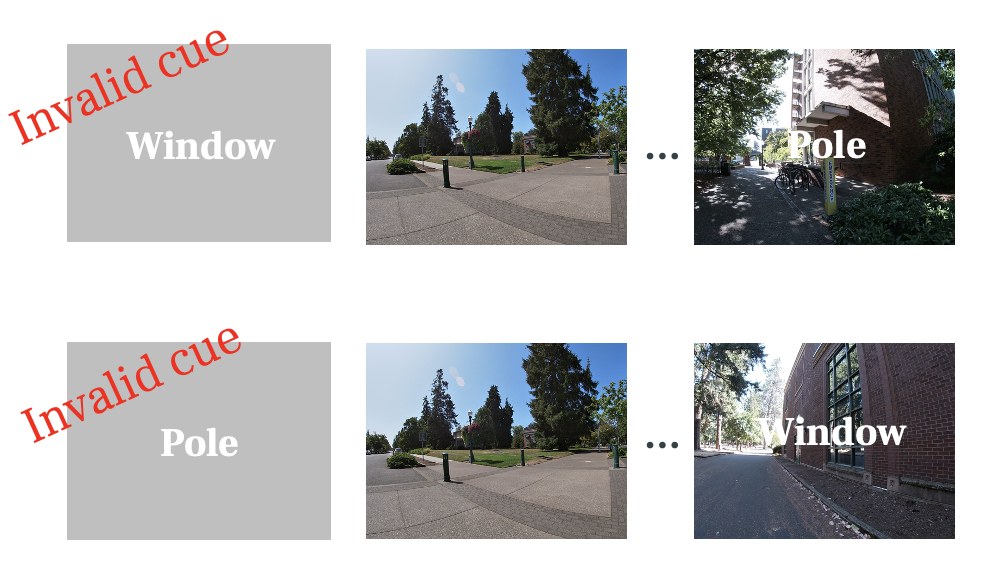

{ width=50% }
{ width=50% }
{ width=50% }

```{r setup, include=FALSE}
knitr::opts_chunk$set(echo=FALSE, warning = FALSE)
knitr::opts_chunk$set(fig.width=10, fig.height=16) 

library(tidyverse)
library(fs)
library(ggplot2)
library(ez)
library(gt)
theme_set(theme_classic(12))

library(ezPurrr)

cbPalette <- c("#CC79A7","#009E73","#0072B2","#E69F00","#56B4E9","#F0E442","#999999","#D55E00")
#pink, green, blue, yellow
```

```{r reading in data, include=FALSE}
converting_read <- function(curr_path){
  print(curr_path)
  
  read_csv(curr_path) %>% mutate(sub = as.character(sub_x))
}

sub_dir = dir_ls(here::here("./csv_files/python_summary"))

rois_names = c('ca23dg-body', 'ca1-body', 
               'evc', 'ppa')

files <- map(sub_dir, dir_ls, glob = '*/*norolling_*summary.csv') %>% unlist()

norolling <- map_dfr(files, converting_read)
  
```

```{r early and late}
sub_p1 = norolling %>% 
  #filter(valid != 'invalid-invalid') %>% 
  filter(sub != '13' & sub != '23') %>% 
  pivot_wider(names_from = type, values_from = cor) %>% 
  mutate(wp_ap = within - across) %>% 
  select(-c(across, within, same)) %>% 
  mutate('segment' = ifelse(within_trial_TR <= 6, 'same',
                            ifelse(within_trial_TR <= 12, 'early-similar',
                                   ifelse(within_trial_TR <= 18, 'late-similar',
                                          'different')
                                   ))) %>% 
  group_by(valid, segment, roi, sub) %>% 
  summarise(m = mean(wp_ap),
            se = sd(wp_ap)/sqrt(n()),
            n = n())
p1 = sub_p1 %>% summarise(mean = mean(m),
            se = sd(m)/sqrt(n()),
            n = n())

p1$segment = factor(p1$segment, levels = c('same', 'early-similar', 'late-similar', 'different'))
p1$roi = factor(p1$roi, levels = c('ca23dg-body', 'ppa', 'ca1-body', 'evc'))
p1$valid = factor(p1$valid, levels = c('valid-valid', 'valid-invalid', 'invalid-invalid'))

ggplot(p1, aes(x = segment, y = mean, fill = roi)) +
      geom_hline(yintercept = 0, linetype="longdash") +
      geom_bar(stat = 'identity', alpha = 0.5, position = position_dodge()) + 
      geom_errorbar(aes(ymin = mean-se, ymax = mean+se), position = position_dodge(width = 0.8), width=0.5) +
      #geom_point(data = sub_p1, aes(x = segment, y = m, color = roi, group = roi), 
      #            position=position_jitterdodge(
      #              jitter.width = 0.2,
      #              dodge.width = 0.75)) + 
      labs(y = 'within_pair - across_pair')+ 
      facet_wrap(valid~roi, ncol = 2, scales = 'free_y')+
      theme(legend.position = 'none',
            legend.title = element_blank(),
            strip.background = element_blank())+ 
  scale_fill_manual(values = cbPalette)+ 
  scale_color_manual(values = cbPalette)

```

ANOVA across ROI (ca23dg & ppa), segment, and valid

```{r}
ezANOVA(data=sub_p1 %>% filter(roi %in% c('ca23dg-body', 'ppa')),
        wid=sub,
        within = .(valid, segment, roi),
        dv = m)$ANOVA %>% knitr::kable()
```

ANOVA across segment and valid for PPA

```{r}
ezANOVA(data=sub_p1 %>% filter(roi == 'ppa'),
        wid=sub,
        within = .(valid, segment),
        dv = m)$ANOVA %>% knitr::kable()
```

ANOVA across segment and valid for CA23DG

```{r}
ezANOVA(data=sub_p1 %>% filter(roi == 'ca23dg-body'),
        wid=sub,
        within = .(valid, segment),
        dv = m)$ANOVA %>% knitr::kable()
```

t-tests

```{r}
t = sub_p1 %>% 
  group_by(segment, valid, roi) %>% 
  nest() %>% 
  broadcast(~t.test(.$m)$p.value) %>% 
  unnest(output) %>% 
  #mutate(sig = ifelse(output <= 0.05, TRUE, FALSE)) %>% 
  select(-data) %>% 
  pivot_wider(names_from = valid,
              values_from = output)

a = sub_p1 %>% select(-c(se, n)) %>% 
  pivot_wider(names_from = valid,
              values_from = m) %>% 
  group_by(segment, roi) %>% 
  nest() %>% 
  broadcast(~t.test(.$`valid-valid`, .$`valid-invalid`, 
                    paired = TRUE)$p.value) %>%
  unnest(output) %>%
  mutate(paired = output) %>% 
  select(-c(data, output)) 

t = inner_join(t, a, by = c("segment", "roi"))
t$segment = factor(t$segment, levels = c('same', 'early-similar', 'late-similar', 'different'))
t$roi = factor(t$roi, levels = c('ca23dg-body', 'ppa', 'ca1-body', 'evc'))


t %>% ungroup() %>% 
  gt(
    rowname_col = "row",
    groupname_col = "segment"
  ) %>%
  row_group_order(groups = c("same","early-similar","late-similar","different")) %>%
  tab_header(title = "Valid Stats") %>%
  
  fmt_number(
    columns = c(`valid-invalid`, `valid-valid`, `invalid-invalid`, paired),
    decimals = 3
  ) %>%
  tab_style(
    style = list(
      cell_fill(color = "lightcyan"),
      cell_text(weight = "bold",
                color = "red")
      ),
    locations = cells_body(
      columns = `valid-invalid`,
      rows = `valid-invalid` < 0.05
    )
  )%>%
  tab_style(
    style = list(
      cell_fill(color = "lightcyan"),
      cell_text(weight = "bold",
                color = "red")
      ),
    locations = cells_body(
      columns = `valid-valid`,
      rows = `valid-valid` < 0.05
    )
  )%>%
  tab_style(
    style = list(
      cell_fill(color = "lightcyan"),
      cell_text(weight = "bold",
                color = "red")
      ),
    locations = cells_body(
      columns = `invalid-invalid`,
      rows = `invalid-invalid` < 0.05
    )
  )%>%
  tab_style(
    style = list(
      cell_fill(color = "lightcyan"),
      cell_text(weight = "bold",
                color = "red")
      ),
    locations = cells_body(
      columns = `paired`,
      rows = `paired` < 0.05
    )
  )
```


```{r together}
sub_p2 = norolling %>% 
  #filter(valid != 'invalid-invalid') %>% 
  filter(sub != '13' & sub != '23') %>% 
  pivot_wider(names_from = type, values_from = cor) %>% 
  mutate(wp_ap = within - across) %>% 
  select(-c(across, within, same)) %>% 
  mutate('segment' = ifelse(within_trial_TR <= 6, 'same',
                            ifelse(within_trial_TR <= 18, 'similar','different')
                                   )) %>% 
  group_by(valid, segment, roi, sub) %>% 
  summarise(m = mean(wp_ap),
            se = sd(wp_ap)/sqrt(n()),
            n = n())
p2 = sub_p2 %>% summarise(mean = mean(m),
            se = sd(m)/sqrt(n()),
            n = n())

p2$segment = factor(p2$segment, levels = c('same', 'similar', 'different'))
p2$roi = factor(p2$roi, levels = c('ca23dg-body', 'ppa', 'ca1-body', 'evc'))
p2$valid = factor(p2$valid, levels = c('valid-valid', 'valid-invalid', 'invalid-invalid'))

ggplot(p2, aes(x = segment, y = mean, fill = roi)) +
      geom_hline(yintercept = 0, linetype="longdash") +
      geom_bar(stat = 'identity', alpha = 0.5, position = position_dodge()) + 
      geom_errorbar(aes(ymin = mean-se, ymax = mean+se), position = position_dodge(width = 0.8), width=0.5) +
      #geom_point(data = sub_p1, aes(x = segment, y = m, color = roi, group = roi), 
      #            position=position_jitterdodge(
      #              jitter.width = 0.2,
      #              dodge.width = 0.75)) + 
      labs(y = 'within_pair - across_pair')+ 
      facet_wrap(valid~roi, ncol = 2, scales = 'free_y')+
      theme(legend.position = 'none',
            legend.title = element_blank(),
            strip.background = element_blank())+ 
  scale_fill_manual(values = cbPalette)+ 
  scale_color_manual(values = cbPalette)

```

ANOVA across ROI (ca23dg & ppa), segment, and valid

```{r}
ezANOVA(data=sub_p2 %>% filter(roi %in% c('ca23dg-body', 'ppa')),
        wid=sub,
        within = .(valid, segment, roi),
        dv = m)$ANOVA %>% knitr::kable()
```

ANOVA across segment and valid for PPA

```{r}
ezANOVA(data=sub_p2 %>% filter(roi == 'ppa'),
        wid=sub,
        within = .(valid, segment),
        dv = m)$ANOVA %>% knitr::kable()
```

ANOVA across segment and valid for CA23DG

```{r}
ezANOVA(data=sub_p2 %>% filter(roi == 'ca23dg-body'),
        wid=sub,
        within = .(valid, segment),
        dv = m)$ANOVA %>% knitr::kable()
```

t-tests

```{r}

t = sub_p2 %>% 
  group_by(segment, valid, roi) %>% 
  nest() %>% 
  broadcast(~t.test(.$m)$p.value) %>% 
  unnest(output) %>% 
  #mutate(sig = ifelse(output <= 0.05, TRUE, FALSE)) %>% 
  select(-data) %>% 
  pivot_wider(names_from = valid,
              values_from = output)

a = sub_p2 %>% select(-c(se, n)) %>% 
  pivot_wider(names_from = valid,
              values_from = m) %>% 
  group_by(segment, roi) %>% 
  nest() %>% 
  broadcast(~t.test(.$`valid-valid`, .$`valid-invalid`, 
                    paired = TRUE)$p.value) %>%
  unnest(output) %>%
  mutate(paired = output) %>% 
  select(-c(data, output)) 

t = inner_join(t, a, by = c("segment", "roi"))

t %>% ungroup() %>% 
  gt(
    rowname_col = "row",
    groupname_col = "segment"
  ) %>%
  row_group_order(groups = c("same","similar","different")) %>%
  tab_header(title = "Valid Stats") %>%
  
  fmt_number(
    columns = c(`valid-invalid`, `valid-valid`, `invalid-invalid`, paired),
    decimals = 3
  ) %>%
  tab_style(
    style = list(
      cell_fill(color = "lightcyan"),
      cell_text(weight = "bold",
                color = "red")
      ),
    locations = cells_body(
      columns = `valid-invalid`,
      rows = `valid-invalid` < 0.05
    )
  )%>%
  tab_style(
    style = list(
      cell_fill(color = "lightcyan"),
      cell_text(weight = "bold",
                color = "red")
      ),
    locations = cells_body(
      columns = `valid-valid`,
      rows = `valid-valid` < 0.05
    )
  )%>%
  tab_style(
    style = list(
      cell_fill(color = "lightcyan"),
      cell_text(weight = "bold",
                color = "red")
      ),
    locations = cells_body(
      columns = `invalid-invalid`,
      rows = `invalid-invalid` < 0.05
    )
  )%>%
  tab_style(
    style = list(
      cell_fill(color = "lightcyan"),
      cell_text(weight = "bold",
                color = "red")
      ),
    locations = cells_body(
      columns = `paired`,
      rows = `paired` < 0.05
    )
  )
```


```{r}

t = sub_p2 %>% 
  select(-c(se, n)) %>% 
  pivot_wider(names_from = segment, values_from = m) %>% 
  group_by(valid, roi) %>% 
  nest() %>% 
  broadcast(~t.test(.$same, .$similar, paired = TRUE)$p.value) %>% 
  unnest(output) %>% 
  mutate(`same-similar` = output) %>%
  broadcast(~t.test(.$similar, .$different, paired = TRUE)$p.value) %>% 
  unnest(output) %>% 
  mutate(`similar-different` = output) %>% 
  broadcast(~t.test(.$same, .$different, paired = TRUE)$p.value) %>% 
  unnest(output) %>% 
  mutate(`same-different` = output) %>% 
  select(-c(data, output))


t %>% ungroup() %>% 
  gt(
    rowname_col = "row",
    groupname_col = "valid"
  ) %>%
  row_group_order(groups = c("valid-valid", "valid-invalid", "invalid-invalid")) %>%
  tab_header(title = "Segment Stats") %>% 
  fmt_number(
    columns = c(`same-similar`, `similar-different`, `same-different`),
    decimals = 3
  ) %>% 
  tab_style(
    style = list(
      cell_fill(color = "lightcyan"),
      cell_text(weight = "bold",
                color = "red")
      ),
    locations = cells_body(
      columns = `same-similar`,
      rows = `same-similar` < 0.05
    )
  )%>%
  tab_style(
    style = list(
      cell_fill(color = "lightcyan"),
      cell_text(weight = "bold",
                color = "red")
      ),
    locations = cells_body(
      columns = `similar-different`,
      rows = `similar-different` < 0.05
    )
  )%>%
  tab_style(
    style = list(
      cell_fill(color = "lightcyan"),
      cell_text(weight = "bold",
                color = "red")
      ),
    locations = cells_body(
      columns = `same-different`,
      rows = `same-different` < 0.05
    )
  ) 
```


# Tests

## Separating by behavior

post-test2

```{r include=FALSE}

converting_read_behav <- function(curr_path){
  print(curr_path)
  read_csv(curr_path) %>% mutate(sub = as.character(sub))
}


sub_dir = dir_ls(here::here("./csv_files/behavior"))

postscan2_behav <- map(sub_dir, dir_ls, glob = '*postscan2*_behav*.csv') %>% unlist()

postscan2_batch <- map_dfr(postscan2_behav, converting_read_behav)

postscan2_batch = postscan2_batch %>% 
  filter(!(sub %in% c(13,14,23,30,34))) %>% 
  mutate(
  correct = ifelse(!is.na(post_first_resp_obj) & post_first_resp_obj == destination, 1, 0))

behav_df = postscan2_batch %>% group_by(sub) %>% 
  filter(correct == 1) %>% 
  summarise(m_npic = mean(npic, na.rm = TRUE))

newdata <- behav_df[order(behav_df$m_npic),] 

n = floor(nrow(newdata) / 2)

performance = c(rep('good', n), rep('bad', nrow(newdata)-n))

newdata$performance = c(rep('good', n), rep('bad', nrow(newdata)-n))

newdata %>% group_by(performance) %>% summarise(m = mean(m_npic))
```


```{r}

sub_p3 = left_join(sub_p1, newdata, on = 'sub')

p3 = sub_p3 %>% 
  group_by(valid, segment, roi, performance) %>% 
  summarise(mean = mean(m),
            se = sd(m)/sqrt(n()),
            n = n())

p3$segment = factor(p3$segment, levels = c('same', 'early-similar', 'late-similar', 'different'))
p3$roi = factor(p3$roi, levels = c('ca23dg-body', 'ppa', 'ca1-body', 'evc'))
p3$valid = factor(p3$valid, levels = c('valid-valid', 'valid-invalid', 'invalid-invalid'))

ggplot(p3, aes(x = segment, y = mean, fill = performance)) +
      geom_hline(yintercept = 0, linetype="longdash") +
      geom_bar(stat = 'identity', alpha = 0.5, position = position_dodge()) + 
      geom_errorbar(aes(ymin = mean-se, ymax = mean+se), position = position_dodge(width = 0.8), width=0.5) +
      labs(y = 'within_pair - across_pair')+ 
      facet_wrap(valid~roi, ncol = 2, scales = 'free_y')+
      theme(legend.position = 'top',
            legend.title = element_blank(),
            strip.background = element_blank())+ 
  scale_fill_manual(values = cbPalette)+ 
  scale_color_manual(values = cbPalette)

```

post-test1

```{r}

good = c('06', '07', '08', '09', '10', '11', '12', '15', '16', '17', '18', '19', '21', '22', '25', '26', '28', '29', '31', '32', '33', '35', '36', '37')

bad = c('20', '24', '27')

```


```{r}
sub_p4 = sub_p1 %>% 
  filter(!(sub %in% bad))

unique(sub_p4$sub)

p4 = sub_p4 %>% 
  group_by(valid, segment, roi) %>% 
  summarise(mean = mean(m),
            se = sd(m)/sqrt(n()),
            n = n())

p4$segment = factor(p4$segment, levels = c('same', 'early-similar', 'late-similar', 'different'))
p4$roi = factor(p4$roi, levels = c('ca23dg-body', 'ppa', 'ca1-body', 'evc'))
p4$valid = factor(p4$valid, levels = c('valid-valid', 'valid-invalid', 'invalid-invalid'))

ggplot(p4, aes(x = segment, y = mean, fill = roi)) +
      geom_hline(yintercept = 0, linetype="longdash") +
      geom_bar(stat = 'identity', alpha = 0.5, position = position_dodge()) + 
      geom_errorbar(aes(ymin = mean-se, ymax = mean+se), position = position_dodge(width = 0.8), width=0.5) +
      labs(y = 'within_pair - across_pair')+ 
      facet_wrap(valid~roi, ncol = 2, scales = 'free_y')+
      theme(legend.position = 'none',
            legend.title = element_blank(),
            strip.background = element_blank())+ 
  scale_fill_manual(values = cbPalette)+ 
  scale_color_manual(values = cbPalette)


t = sub_p4 %>% 
  group_by(segment, valid, roi) %>% 
  nest() %>% 
  broadcast(~t.test(.$m)$p.value) %>% 
  unnest(output) %>% 
  #mutate(sig = ifelse(output <= 0.05, TRUE, FALSE)) %>% 
  select(-data) %>% 
  pivot_wider(names_from = valid,
              values_from = output)

a = sub_p4 %>% select(-c(se, n)) %>% 
  pivot_wider(names_from = valid,
              values_from = m) %>% 
  group_by(segment, roi) %>% 
  nest() %>% 
  broadcast(~t.test(.$`valid-valid`, .$`valid-invalid`, 
                    paired = TRUE)$p.value) %>%
  unnest(output) %>%
  mutate(paired = output) %>% 
  select(-c(data, output)) 

t = inner_join(t, a, by = c("segment", "roi"))

t %>% ungroup() %>% 
  gt(
    rowname_col = "row",
    groupname_col = "segment"
  ) %>%
  row_group_order(groups = c("same","early-similar","late-similar", "different")) %>%
  tab_header(title = "Stats") %>%
  
  fmt_number(
    columns = c(`valid-invalid`, `valid-valid`, `invalid-invalid`, paired),
    decimals = 3
  ) %>%
  tab_style(
    style = list(
      cell_fill(color = "lightcyan"),
      cell_text(weight = "bold",
                color = "red")
      ),
    locations = cells_body(
      columns = `valid-invalid`,
      rows = `valid-invalid` < 0.05
    )
  )%>%
  tab_style(
    style = list(
      cell_fill(color = "lightcyan"),
      cell_text(weight = "bold",
                color = "red")
      ),
    locations = cells_body(
      columns = `valid-valid`,
      rows = `valid-valid` < 0.05
    )
  )%>%
  tab_style(
    style = list(
      cell_fill(color = "lightcyan"),
      cell_text(weight = "bold",
                color = "red")
      ),
    locations = cells_body(
      columns = `invalid-invalid`,
      rows = `invalid-invalid` < 0.05
    )
  )%>%
  tab_style(
    style = list(
      cell_fill(color = "lightcyan"),
      cell_text(weight = "bold",
                color = "red")
      ),
    locations = cells_body(
      columns = `paired`,
      rows = `paired` < 0.05
    )
  )
```

