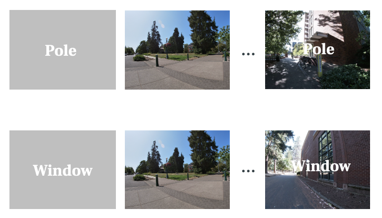
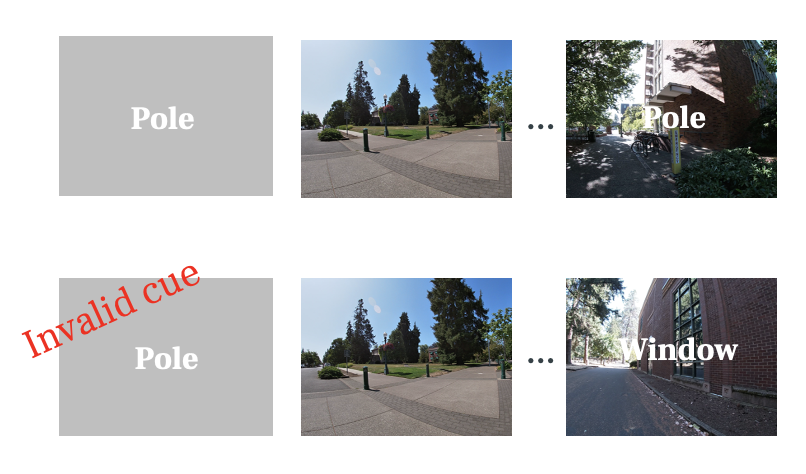

```{r setup, include=FALSE}
knitr::opts_chunk$set(echo=FALSE, warning = FALSE)
knitr::opts_chunk$set(fig.width=12, fig.height=8) 

library(tidyverse)
library(fs)
library(ggplot2)
library(ez)
theme_set(theme_classic(18))

library(ezPurrr)

cbPalette <- c("#CC79A7","#009E73","#0072B2","#E69F00","#56B4E9","#F0E442","#999999","#D55E00")
#pink, green, blue, yellow
```


```{r}

group_valid_type = function(sample){
  
  sample %>% group_by(valid, type) %>% 
    summarise(m = mean(r),
              .groups = 'drop') %>% 
    pivot_wider(names_from = type,
                values_from = m)
}

calculate_mean = function(sample){
  
  summary = sample %>% 
    summarise(across_pair = mean(across_pair),
              within_pair = mean(within_pair),
              within_item = mean(within_item))
  
  summary
  
}
```

```{r plotting function}

making_4_plots <- function(df){
  
  tmp = df %>% mutate(wp_ap = within_pair - across_pair,
                      wi_wp = within_item - within_pair,
         segment = factor(segment, levels = c('same', 'overlapping', 'non-overlapping'))) 

  tmp$roi =  factor(tmp$roi,
                levels = c('ca23dg-body', 'ca23dg',
                           'ppa',
                           'ca1-body', 'ca1',
                           'hippocampus', 
                           'angular_gyrus', 'evc'))
  
  tmp_sub = tmp %>% group_by(segment, valid, within_trial_TR, roi) %>%
    summarise(wp_ap_m = mean(wp_ap),
              wp_ap_se = sd(wp_ap)/sqrt(n()),
              wi_wp_m = mean(wi_wp),
              wi_wp_se = sd(wi_wp)/sqrt(n()),
              )

  tmp_sub$roi =  factor(tmp_sub$roi,
                           levels = c('ca23dg-body', 'ca23dg',
                                      'ppa',
                                      'ca1-body', 'ca1',
                                      'hippocampus', 
                                      'angular_gyrus', 'evc'))

  p1 = tmp_sub %>% 
    filter(roi != 'evc' & roi != 'ca1-body') %>% 
    ggplot(aes(x = within_trial_TR, y = wp_ap_m, color = roi)) +
    geom_hline(yintercept = 0, linetype="longdash") +
    geom_vline(xintercept=6, linetype="longdash") +
    geom_vline(xintercept=18, linetype="longdash") +
    geom_ribbon(aes(ymin = wp_ap_m-wp_ap_se, 
                    ymax = wp_ap_m+wp_ap_se,
                    fill = roi),
                alpha = 0.2,
                color = NA) +
    geom_line(size = 1)+
    labs(y = 'within_pair - across_pair',
         x = 'within trial timepoint') + 
    theme(legend.position = 'bottom',
          legend.title = element_blank())+ 
  scale_fill_manual(values = cbPalette)+ 
  scale_color_manual(values = cbPalette)
  
  p2 = tmp_sub %>% 
    filter(roi != 'evc' & roi != 'ca1-body') %>% 
    ggplot(aes(x = within_trial_TR, y = wi_wp_m, color = roi)) +
    geom_hline(yintercept = 0, linetype="longdash") +
    geom_vline(xintercept=6, linetype="longdash") +
    geom_vline(xintercept=18, linetype="longdash") +
    geom_ribbon(aes(ymin = wi_wp_m-wi_wp_se, 
                    ymax = wi_wp_m+wi_wp_se,
                    fill = roi),
                alpha = 0.2,
                color = NA) +
    geom_line(size = 1)+
    labs(y = 'within_item - within_pair',
         x = 'within trial timepoint') + 
    theme(legend.position = 'bottom',
          legend.title = element_blank())+ 
  scale_fill_manual(values = cbPalette)+ 
  scale_color_manual(values = cbPalette)
  
    tmp2 = tmp %>% group_by(sub, segment, valid, roi) %>% 
      summarise(wp_ap_m = mean(wp_ap),
                wp_ap_se = sd(wp_ap)/sqrt(n())
                )
    
    p3 = tmp2 %>% group_by(segment, valid, roi) %>% 
      summarise(m = mean(wp_ap_m),
                se = sd(wp_ap_m)/sqrt(n()),
                n = n()
                ) %>% 
      ggplot(aes(x = segment, y = m, fill = roi)) +
      geom_hline(yintercept = 0, linetype="longdash") +
      geom_bar(stat = 'identity', alpha = 0.5, position = position_dodge()) + 
      geom_errorbar(aes(ymin = m-se, ymax = m+se), position = position_dodge(width = 0.8), width=0.5) +
      geom_point(data = tmp2, aes(x = segment, y = wp_ap_m, color = roi, group = roi), 
                  position=position_jitterdodge(
                    jitter.width = 0.2,
                    dodge.width = 0.75)) + 
      labs(y = 'within_pair - across_pair')+ 
      facet_wrap(~roi, ncol = 2, scales = 'free_y')+
      theme(legend.position = 'none',
            legend.title = element_blank(),
            strip.background = element_blank())+ 
  scale_fill_manual(values = cbPalette)+ 
  scale_color_manual(values = cbPalette)
    
    tmp3 = tmp %>% group_by(sub, segment, valid, roi) %>% 
      summarise(wi_wp_m = mean(wi_wp),
                wi_wp_se = sd(wi_wp)/sqrt(n())
                )
    
    p4 = tmp3 %>% group_by(segment, valid, roi) %>% 
      summarise(m = mean(wi_wp_m),
                se = sd(wi_wp_m)/sqrt(n()),
                n = n()
                ) %>% 
      ggplot(aes(x = segment, y = m, fill = roi)) +
      geom_hline(yintercept = 0, linetype="longdash") +
      geom_bar(stat = 'identity', alpha = 0.5, position = position_dodge()) + 
      geom_errorbar(aes(ymin = m-se, ymax = m+se), position = position_dodge(width = 0.8), width=0.5) +
      geom_point(data = tmp3, aes(x = segment, y = wi_wp_m, color = roi, group = roi), 
                  position=position_jitterdodge(
                    jitter.width = 0.2,
                    dodge.width = 0.75)) + 
      labs(y = 'within_item - within_pair')+ 
      facet_wrap(~roi, ncol = 2, scales = 'free_y')+
      theme(legend.position = 'none',
            legend.title = element_blank(),
            strip.background = element_blank())+ 
  scale_fill_manual(values = cbPalette)+ 
  scale_color_manual(values = cbPalette)
    
    list(p1, p2, list(tmp2,p3), list(tmp3,p4))
}

```


```{r reading in data}

re_process = FALSE
file_name =  './csv_files/R-tmp/all-sub-df_n=18_1024.RDS'

if (re_process){

  rois_names = c('ca23dg-body', 'ca1-body', 
                 'evc', 'ppa')
                 #'ca23dg', 'ca1',
                 #'angular_gyrus', 'evc', 
                 #'hippocampus', 'ppa')
  
  rdata_dir = here::here("./csv_files/cluster_RDS/")
  
  roi_dir = dir_ls(here::here("csv_files/cluster_RDS/"),  type = "directory")
  processed_sub_list = map(roi_dir, dir_ls) %>% unlist() %>% 
    map_chr(~gsub('.*/sub-([0-9]+)_.*','\\1', .x)) %>% 
    unlist() %>% 
    unique()
  
  remove('huge_df')
  
  for (roi in rois_names){
    for (sub in processed_sub_list){
      curr_df = readRDS(file.path(rdata_dir, roi, paste0('sub-', sub, '_', roi, '.RDS'))) %>% unnest(output) 
      
      curr_df$sub = sub
      curr_df$roi = roi
      if (exists('huge_df')){
        huge_df = rbind(huge_df, curr_df)
      } else(
        huge_df = curr_df
      )
    }
  }
  
  # Take long to run:
  all_sub_df = huge_df %>% 
    broadcast(group_valid_type)
  
    
  saveRDS(all_sub_df, file = file_name)
    
}else{
  all_sub_df = readRDS(file = file_name)
}

```


```{r}
all_sub_df = all_sub_df %>% 
  filter(sub != '13' & sub != '14' & sub != '23')
```

## n = `r length(unique(all_sub_df$sub))`

```{r}
all_sub_df_unnest = all_sub_df %>% 
  select(-data) %>% unnest(output)

all_sub_df_clean = all_sub_df_unnest %>% 
  mutate(valid = ifelse(valid == 'invalid-valid',
                              'valid-invalid', valid))
```

# All Timepoints (10 runs)

## Valid - Valid

{ width=50% }

```{r}

all_sub_df_valid = all_sub_df_clean %>% mutate(wp_ap = within_pair - across_pair,
                      wi_wp = within_item - within_pair,
         segment = factor(segment, levels = c('same', 'overlapping', 'non-overlapping'))) %>% 
  filter(valid == 'valid-valid')

  
all_sub_plot = all_sub_df_valid %>% 
  group_by(segment, within_trial_TR, roi, sub, valid) %>%
  nest() %>% 
  broadcast(calculate_mean) %>% 
  select(-data) %>% 
  unnest(cols = output)

output = making_4_plots(all_sub_plot)
```

### within_pair - across_pair

```{r}
output[[3]][[2]]
```

#### Statistics:

```{r}
data = output[[3]][[1]]
```


ROI x Segment ANOVA
```{r}
ezANOVA(data=data,
        wid=sub,
        within = .(roi, segment),
        dv = wp_ap_m)$ANOVA %>% knitr::kable()
```

Segment One-way ANOVA for CA23DG
```{r}
ezANOVA(data=data %>% filter(roi == 'ca23dg-body'),
        wid=sub,
        within = .(segment),
        dv = wp_ap_m)$ANOVA %>% knitr::kable()
```

### One-sample t-test for CA23DG

```{r}
ca23dg = data %>% filter(roi == 'ca23dg-body')
```


 - Same segment
```{r}
t.test(ca23dg %>% filter(segment == 'same') %>% .$wp_ap_m)
```

 - Overlapping segment
```{r}
t.test(ca23dg %>% filter(segment == 'overlapping') %>% .$wp_ap_m)

```

 - Non-overlapping segment
```{r}
t.test(ca23dg %>% filter(segment == 'non-overlapping') %>% .$wp_ap_m)
```

### One-sample t-test for CA1

```{r}
ca1 = data %>% filter(roi == 'ca1-body')
```


 - Same segment
```{r}
t.test(ca1 %>% filter(segment == 'same') %>% .$wp_ap_m)
```

 - Overlapping segment
```{r}
t.test(ca1 %>% filter(segment == 'overlapping') %>% .$wp_ap_m)

```

 - Non-overlapping segment
```{r}
t.test(ca1 %>% filter(segment == 'non-overlapping') %>% .$wp_ap_m)
```

### One-sample t-test for PPA

```{r}
ppa = data %>% filter(roi == 'ppa')
```


 - Same segment
```{r}
t.test(ppa %>% filter(segment == 'same') %>% .$wp_ap_m)
```

 - Overlapping segment
```{r}
t.test(ppa %>% filter(segment == 'overlapping') %>% .$wp_ap_m)

```

 - Non-overlapping segment
```{r}
t.test(ppa %>% filter(segment == 'non-overlapping') %>% .$wp_ap_m)
```

### One-sample t-test for EVC

```{r}
evc = data %>% filter(roi == 'evc')
```

 - Same segment
```{r}
t.test(evc %>% filter(segment == 'same') %>% .$wp_ap_m)
```

 - Overlapping segment
```{r}
t.test(evc %>% filter(segment == 'overlapping') %>% .$wp_ap_m)

```

 - Non-overlapping segment
```{r}
t.test(evc %>% filter(segment == 'non-overlapping') %>% .$wp_ap_m)
```


```{r}
output[[1]]
```


```{r eval=FALSE, include=FALSE}
### within_item - within_pair
output[[4]][[2]]
output[[2]]
```


## Valid - Invalid

{ width=50% }

```{r}

all_sub_df_invalid = all_sub_df_clean %>% mutate(wp_ap = within_pair - across_pair,
                      wi_wp = within_item - within_pair,
         segment = factor(segment, levels = c('same', 'overlapping', 'non-overlapping'))) %>% 
  filter(valid == 'valid-invalid')

  
all_sub_plot = all_sub_df_invalid %>% 
  group_by(segment, within_trial_TR, roi, sub, valid) %>%
  nest() %>% 
  broadcast(calculate_mean) %>% 
  select(-data) %>% 
  unnest(cols = output)

output = making_4_plots(all_sub_plot)
```

### within_pair - across_pair

```{r}
output[[3]][[2]]
output[[1]]
```


```{r eval=FALSE, include=FALSE}

### within_item - within_pair

output[[4]][[2]]
output[[2]]
```


```{r eval=FALSE, include=FALSE}
p1 = tmp_sub %>% 
    filter(roi != 'evc' & roi != 'ca1-body' & roi != 'ca23dg-body') %>% 
    ggplot(aes(x = within_trial_TR, y = wp_ap_m, color = roi)) +
    geom_hline(yintercept = 0, linetype="longdash") +
    geom_vline(xintercept=6, linetype="longdash") +
    geom_vline(xintercept=18, linetype="longdash") +
    geom_ribbon(aes(ymin = wp_ap_m-wp_ap_se, 
                    ymax = wp_ap_m+wp_ap_se,
                    fill = roi),
                alpha = 0.2,
                color = NA) +
    geom_line(size = 1)+
    labs(y = 'within pair - across pair',
         x = element_blank()) + 
    theme(legend.position = 'top',
          legend.title = element_blank())+
      coord_cartesian(xlim = c(0,25), ylim = c(-0.0055, 0.0075)) + 
  scale_fill_manual(values = c(cbPalette[3:8])) + 
  scale_color_manual(values = c(cbPalette[3:8]))

p1


tmp_sub %>% 
    filter(roi != 'evc' & roi != 'ca1-body' & roi != 'ca23dg-body') %>% 
    ggplot(aes(x = within_trial_TR, y = wp_ap_m, color = roi)) +
    geom_hline(yintercept = 0, linetype="longdash") +
    geom_vline(xintercept=6, linetype="longdash") +
    geom_vline(xintercept=18, linetype="longdash") +
    geom_ribbon(aes(ymin = wp_ap_m-wp_ap_se, 
                    ymax = wp_ap_m+wp_ap_se,
                    fill = roi),
                alpha = 0.2,
                color = NA) +
    geom_line(size = 1)+
    labs(y = 'within pair - across pair',
         x = 'Within Trial Timepoint (seconds)') + 
    theme(legend.position = 'top',
          legend.title = element_blank())+ 
  ylim(-0.006, 0.013)+
  scale_fill_manual(values = cbPalette[2:8])+ 
  scale_color_manual(values = cbPalette[2:8])


p2 = postscan2_batch %>%
    filter(correct == 1) %>%
    ggplot(aes(x = ceiling_tp)) +
    geom_histogram(binwidth = 1) +
    geom_vline(xintercept=6, linetype="longdash") +
    geom_vline(xintercept=18, linetype="longdash") +
    scale_x_continuous(breaks = seq(0,25,1), limit = c(0,25))+
    xlab("Within Trial Timepoint (seconds)")+
    ylab('Correct Count') +
    theme_classic(18)+
    coord_cartesian(xlim = c(0,25))
  
library(cowplot)
plot_grid(p1, p2, ncol=1, align='v', rel_heights = c(2/3, 1/3))
```

